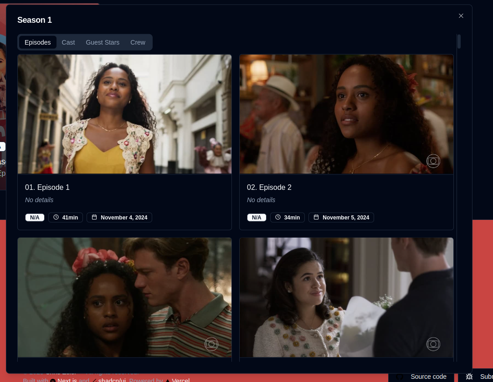
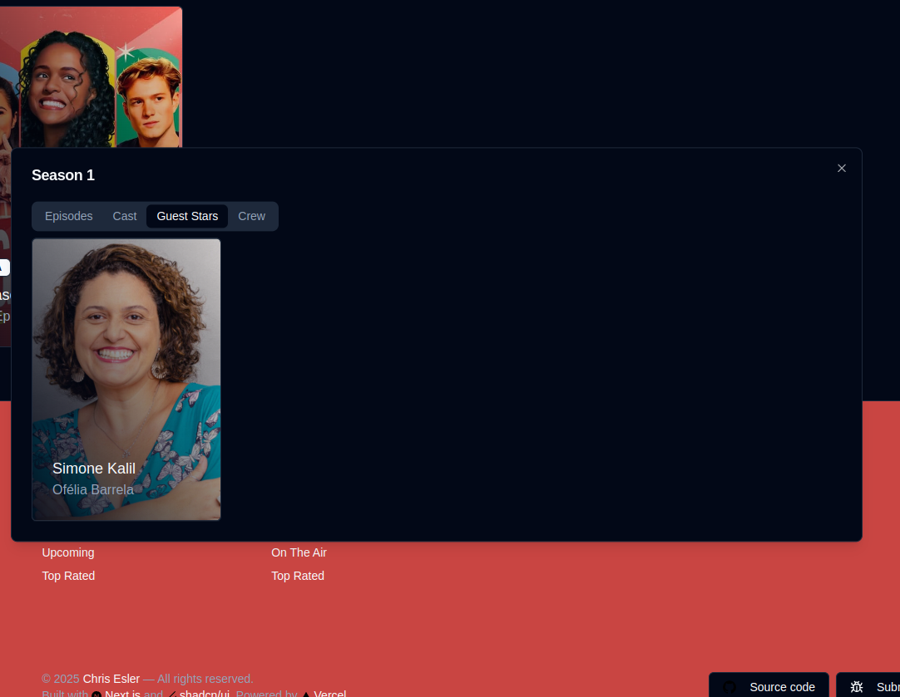
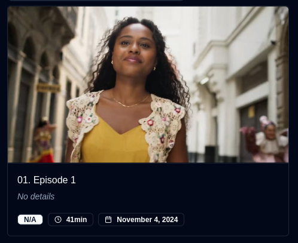
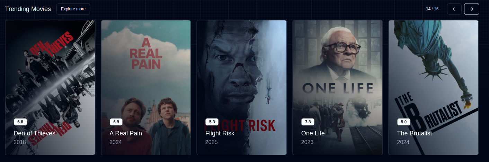
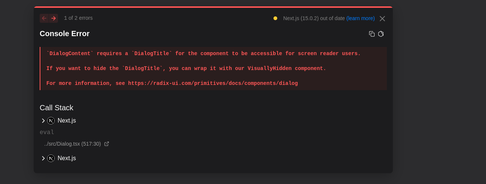

# Findings report

## Clerk authentication system use in middleware but no features to user related

for the context of the interview exercise the user/candidate needs the most simple way to start the project since the documentation does not provide any information other than a future implementation of the authentication with clerk. This makes it difficult to quickly inspect the project on manual testing.

**_Note_** removed for tenting proposes
https://movie-app-fu.vercel.app/

## Episodes modal minimum size

If a Tv program hasn't enough information the size change to minimum instead of conserve a constant size
**_Reference_**
https://movie-app-fu.vercel.app/tv/257048/seasons?s=1

## Hide No details on episodes card

## Potential scrolling on movies carousel

Improve usability of component reducing interactions

## Missing dialog title on trailer modal

